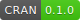
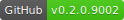
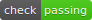
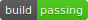

<!-- README.md is generated from README.Rmd. Please edit that file -->

```{r, echo = FALSE}
knitr::opts_chunk$set(
  collapse = TRUE,
  comment = "#>",
  fig.path = "README-"
)
```

# bioset

<!--[](https://cran.r-project.org/package=bioset)-->
[](https://cran.r-project.org/package=bioset)
[](https://github.com/randomchars42/bioset/releases)
[](https://github.com/randomchars42/bioset/releases)
[](https://github.com/randomchars42/bioset/releases)


```{r, child = "vignettes/introduction.Rmd"}
```

